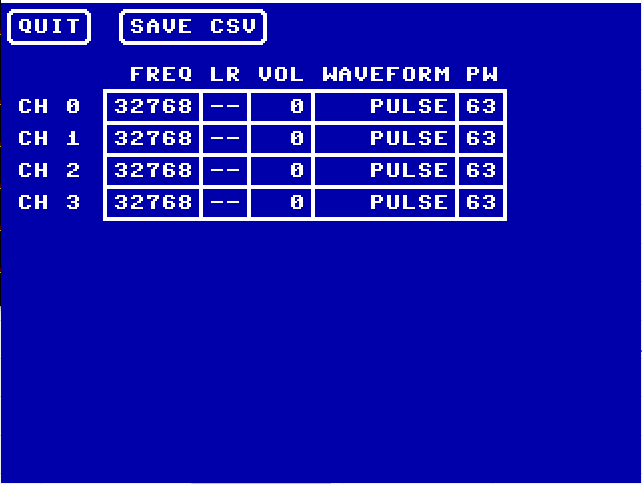

# MakeWave
A 4-voice PSG instrument for Commander X16 retrocomputer

## Introduction
MakeWave is a digital instrument that uses the Programmable Sound Generator (PSG)
in the Commander X16 retrocomputer. While the PSG supports 16 voices, this
instrument only uses 4 to help develop sounds effects or musical intruments
that can be played simultaneously with 3 other 4-voice sounds.

When your desired sound and pitch is achieved, you can save the configuration
to a comma-separated-value (CSV) file that has the settings for all 4 voices
as a simple table that can be loaded into any text editor or spreadsheet program.

## Build
If using a pre-built release, skip to [Installation](#installation).

Required tools (all executables assumed to be in path):
* [git](https://git-scm.com/)
* [GNU make](https://www.gnu.org/software/make/)
* [cc65](https://github.com/cc65/cc65)

First, clone the repo to your local workspace:

```
$ git clone https://github.com/SlithyMatt/x16-makewave.git
```

Next, go into the repo directory and run GNU make:

```
$ cd x16-makewave
$ make
```

This will create **MAKEWAVE.PRG** in the repo directory, along with other
build artifacts.

## Installation
Copy **MAKEWAVE.PRG** to the directory from which you will be running the
X16 emulator, or to an SD card (physical or emulated image) that will be
installed (using -sdcard with the emulator, or physically inserted into
the X16). No other files are required to run.

From the X16 BASIC prompt, simply load and run the PRG:

```
LOAD "MAKEWAVE.PRG"
RUN
```

If loading from a different file device (i.e. not the emulator host file system
or the SD card), append the required arguments to the
LOAD command, as documented in the X16 user's guide.

## User Interface


MakeWave is driven with a combination of the mouse and keyboard. A mouse is
required to select and click on any UI elements. The keyboard is required to
enter numerical values.

At start time, all PSG channels are reset to what is shown in the screencap
above (even though only channels 0-3 are shown and configurable later). As
shown, there are 5 parameters for each channel that represent the full range
of configuration available to each PSG channel.

To change a channel parameter, click on it with the mouse cursor. If it is a
numerical parameter, a cursor will appear in the cell for you to type in a
new value. Once it is fully typed in, hit the Enter key to commit the new
value. For other parameters, simply click repeatedly on it until the desired
value is shown. The range and meaning of each parameter is described below.

### Channel Parameters

#### Frequency (FREQ)
Range: 0 to 65535 (0 to 24.4136 kHz)

This is the unsigned 16-bit integer value passed to the PSG to set the wave
frequency for the channel. The sample rate of the PSG is 48.828125 kHz, so the
actual frequency output by the channel will be the integer value entered
multiplied by half the sample rate (24.4140625 kHz) and divided by the integer
range (2^16 or 65536).

This means that the default frequency integer value of 32768 specifies a frequency of
12.207 kHz. For reference, middle C is 262 Hz, which can be best approximated
by entering a value of 703.

#### Left/Right (LR)
Left Range: -,L
Right Range: -,R

By default, each channel is turned off by having a "-" for both the left and
right speaker channels. You can enable output to a speaker channel by clicking
on the character to make either "L" or "R" appear, depending on which you click.
Clicking "L" or "R" again will turn off output to that speaker channel and show
a "-" again.

Note: the PSG does not support different volumes in each speaker channel for
a single voice, so a "fade" effect will require using two separate voice channels.

#### Volume (VOL)
Range: 0 to 63

Controls the volume of the waveform output to all selected speaker channels.
A value of zero effectively turns off that voice, and 63 is the maximum
possible volume. Actual volumes heard in the speakers will be dependent on
amplification and fading of stereo audio signal coming from the X16 or emulation host.

#### Waveform Type (WAVEFORM)
Range: PULSE, SAWTOOTH, TRIANGLE, NOISE

Defines the shape of the wavefore being output for the channel. PULSE is a square
wave, with the duty cycle set by the pulse width. SAWTOOTH only slopes up to
the maximum amplitude. TRIANGLE slopes both up and down from the maximum amplitude.
NOISE is generated with a dominant frequency at the current setting.

#### Pulse Width (PW)
Range: 0 to 63

Defines the duty cycle when a PULSE waveform is selected for the channel. A value of
zero will have an extremely small duty cycle. A value of 63 will produce a full
50% duty cycle.

### Saving CSV File
Clicking on the SAVE CSV button will save all current settings to a text file
called **PSG.CSV**. It will have 4 lines of comma-separated values, containing
all current settings as 5 integer values for each channel.

The column order is Frequency, Left/Right, Volume, Waveform, Pulse Width.

The integer values used for Left/Right are:
* 0 - L and R off
* 1 - L only on
* 2 - R only on
* 3 - L and R on

The integer values for Waveform are:
* 0 - PULSE
* 1 - SAWTOOTH
* 2 - TRIANGLE
* 3 - NOISE

All of these integer values correspond exactly to the values that need to
be written to the PSG registers for each voice channel.

Please note that if **PSG.CSV** is already in the current directory, it will
be overwritten with the current values when this button is clicked. If you need
to save it for later, you will need to quit MakeWave and copy the file off to
another location before running it again.

### Exiting to BASIC
To get back to the BASIC prompt, simply click the QUIT button. If you do not
click SAVE CSV before then, the voice configurations you created will be lost.
